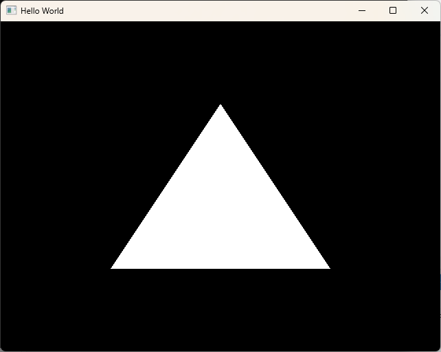

OpenGL 通过调用显卡，强有力绘制图形。


OpenGL不是框架、引擎吗，它是一套规范，规范了API，本身是不涉及任何实现！

OpenGL不是开源的，是跨平台的。


**那么谁负责实现OpenGL API 接口呢？**

答：显卡生产商。


## 开始编码

### P2_CreateWindow

利用glfw进行窗口管理，创建上下文，IO事件分发等！

只需要用pre-build二进制库就可以了，咱们不需要关注glfw内部的源码！

（1）调整输出目录和中间目录路径

（2）引入glfw库的头文件和库路径引用

（3）使用legacy opengl接口，绘制一个三角形


结果如下：




---


### P3_GLEW_UseModernGL

如何访问显卡提供给咱们的API接口呢？当然，在Window平台，可以用Win32接口获取，但是数量太多了，而且版本不同。所以需要一些库进行获取相应的函数指针，这些库叫做glew、glue、glad等


引入glew的几个注意点：

（1）头文件包含的顺序，必须要glfw之前

```c++
#include <GL/glew.h>
#include <GLFW/glfw3.h>
```

（2）glew如果采用静态库链接，必须添加宏GLEW_STATIC

（3）glewInit接口若要调用成功，一定要已经存在Windows上下文！


### P4_VBO_VertexAttribute

介绍现代OpenGL的一些概念：顶点缓冲区（VBO）、VertexAttribute、DrawCall、状态机等概念

利用glDrawArrays绘制一个最简单的三角形！


### P5_Shader

上节我们没有写任何Shader也能绘制一个三角形，其实是驱动程序给的默认Shader。

Shader其实就是跑在GPU上的一段程序，同样需要编译、链接。常见的着色器分为：顶点着色器、片段着色器！

后面学习高级部分还有：几何着色器、细分着色器等等！


顶点着色器，针对每一个Vertex调用一次。片段着色器，针对每一个像素调用一次！


### P8_ShaderOpt

1、Shader代码放到文件中，进行读取获取

2、添加res/shaders资源文件夹

咱们将vertexshader和fragmentshader放到同一个文本中，通过行标识进行切换


